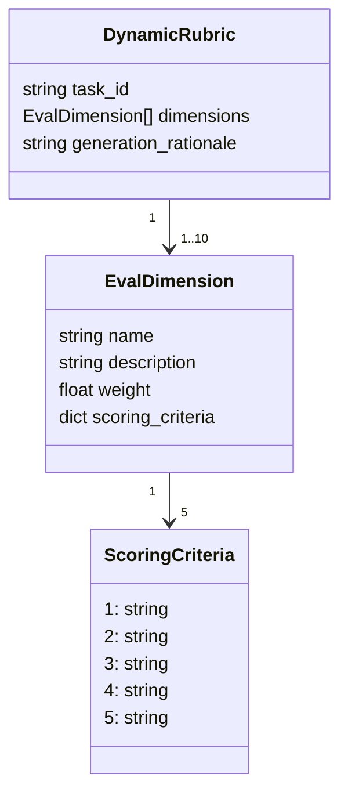

# DynamicRubric Template

Use this template to design or review a task-specific AdaRubric before running
trajectory evaluation.

## Structure



## Field Guide

| Field | Meaning | Notes |
|---|---|---|
| `task_id` | The task this rubric belongs to. | Should match `TaskDescription.task_id`. |
| `generation_rationale` | Why these dimensions were chosen. | Explain the evaluation design at a high level. |
| `dimensions` | List of evaluation dimensions. | Usually 3 to 5 dimensions; max 10 in the model. |
| `name` | Dimension name. | Use concise PascalCase, for example `SearchStrategyQuality`. |
| `description` | What this dimension measures. | Must be observable from the trajectory. |
| `weight` | Relative importance. | Must be greater than 0. Higher means more important. |
| `scoring_criteria` | Concrete 1 to 5 scoring rubric. | Must include exactly scores 1, 2, 3, 4, 5. |

## Rubric

### Task ID

``

### Generation Rationale

<!-- Explain why these dimensions are appropriate for this task. -->


## Dimensions

### Dimension 1

| Field | Value |
|---|---|
| `name` |  |
| `description` |  |
| `weight` |  |

#### Scoring Criteria

| Score | Criteria |
|---|---|
| 1 |  |
| 2 |  |
| 3 |  |
| 4 |  |
| 5 |  |

### Dimension 2

| Field | Value |
|---|---|
| `name` |  |
| `description` |  |
| `weight` |  |

#### Scoring Criteria

| Score | Criteria |
|---|---|
| 1 |  |
| 2 |  |
| 3 |  |
| 4 |  |
| 5 |  |

### Dimension 3

| Field | Value |
|---|---|
| `name` |  |
| `description` |  |
| `weight` |  |

#### Scoring Criteria

| Score | Criteria |
|---|---|
| 1 |  |
| 2 |  |
| 3 |  |
| 4 |  |
| 5 |  |

### Dimension 4

| Field | Value |
|---|---|
| `name` |  |
| `description` |  |
| `weight` |  |

#### Scoring Criteria

| Score | Criteria |
|---|---|
| 1 |  |
| 2 |  |
| 3 |  |
| 4 |  |
| 5 |  |

### Dimension 5

| Field | Value |
|---|---|
| `name` |  |
| `description` |  |
| `weight` |  |

#### Scoring Criteria

| Score | Criteria |
|---|---|
| 1 |  |
| 2 |  |
| 3 |  |
| 4 |  |
| 5 |  |

## JSON Shape

Use this shape when converting the rubric into a `DynamicRubric` object.

```json
{
  "task_id": "",
  "dimensions": [
    {
      "name": "",
      "description": "",
      "weight": 1.0,
      "scoring_criteria": {
        "1": "",
        "2": "",
        "3": "",
        "4": "",
        "5": ""
      }
    }
  ],
  "generation_rationale": ""
}
```
