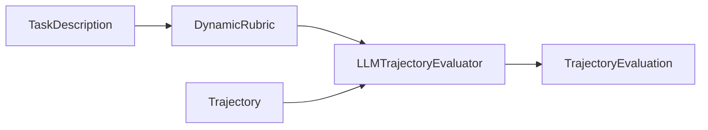
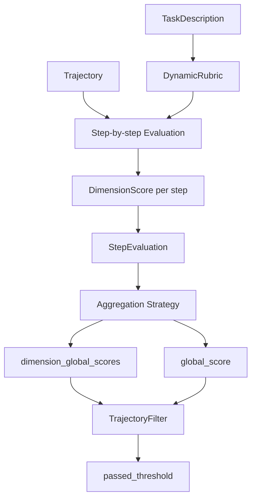

# TrajectoryEvaluation Template

Use this template to document how a task-specific `DynamicRubric` is applied to
an agent `Trajectory`.

## Evaluation Purpose

The purpose of trajectory evaluation is to use a task-specific `DynamicRubric`
to judge how well an agent's execution trajectory satisfies the original task.

A trajectory is evaluated step by step. Each step is compared against the rubric
dimensions generated for the task. For every relevant dimension, the evaluator
assigns a score, confidence, and rationale. These step-level judgments are then
aggregated into per-dimension global scores and an overall trajectory score.

The evaluator should not create new rubric dimensions during scoring. It should
only use the existing `DynamicRubric`, including each dimension's `name`,
`description`, `weight`, and `scoring_criteria`.

## Evaluation Inputs and Output

This diagram shows the evaluation direction: the evaluator receives both the
original trajectory and the already-created rubric, then returns one
`TrajectoryEvaluation`.



## Output Structure

This diagram shows what is stored inside the returned `TrajectoryEvaluation`.
The arrows here mean "contains or references", not evaluation order.

```mermaid
flowchart TD
    A[TrajectoryEvaluation]
    A --> B[rubric_used: DynamicRubric]
    A --> C[step_evaluations: StepEvaluation[]]
    A --> D[dimension_global_scores]
    A --> E[global_score]
    A --> F[passed_threshold]
    C --> G[dimension_scores: DimensionScore[]]
    G --> H[dimension_name]
    G --> I[score]
    G --> J[confidence]
    G --> K[rationale]
```

## Evaluation Questions

| Question | Meaning |
|---|---|
| Did the agent follow the task requirements? | Check whether the trajectory aligns with the original `TaskDescription`. |
| Did the agent perform well on each rubric dimension? | Score the trajectory against task-specific dimensions from `DynamicRubric`. |
| Where did the trajectory succeed or fail? | Use step-level scores and rationales to locate strong and weak steps. |
| Is this trajectory useful downstream? | Use global and dimension scores for filtering, reward assignment, or DPO pair generation. |

## Field Guide

| Field | Meaning | Notes |
|---|---|---|
| `trajectory_id` | The evaluated trajectory. | Should match `Trajectory.trajectory_id`. |
| `task_id` | The task this trajectory belongs to. | Should match `TaskDescription.task_id`. |
| `rubric_used` | The rubric used for evaluation. | Should be the generated or prebuilt `DynamicRubric`. |
| `step_evaluations` | Step-by-step evaluation results. | One entry per evaluated trajectory step. |
| `dimension_global_scores` | Final score for each rubric dimension. | Computed by the aggregation strategy. |
| `global_score` | Overall trajectory score. | Range is 0 to 5 in this project. |
| `passed_threshold` | Whether the trajectory passed filtering. | Set after a filter is applied. |
| `metadata` | Optional extra information. | Useful for model name, run id, timestamp, or source dataset. |

## Scoring Rules

| Field | Meaning | Notes |
|---|---|---|
| `dimension_name` | Rubric dimension being scored. | Must match a dimension name in `rubric_used`. |
| `score` | Step-level score for that dimension. | Integer from 1 to 5. |
| `confidence` | Evaluator confidence in the score. | Float from 0.0 to 1.0. |
| `rationale` | Explanation for the score. | Should cite observable trajectory behavior. |
| `step_quality_summary` | Short summary of the step. | Explains the overall quality of this step. |

## Evaluation Prompt

The evaluation stage is controlled by prompt templates in
`adarubric/evaluator/prompts.py`.

### System Prompt Purpose

The system prompt tells the evaluator how to score an agent trajectory. Its
main instructions are:

| Instruction | Meaning |
|---|---|
| Read the rubric carefully. | Use the existing `DynamicRubric` and its 1 to 5 criteria. |
| Evaluate each step independently. | Score each `Thought -> Action -> Observation` step. |
| Score every applicable dimension. | Use rubric dimension names exactly; do not invent new ones. |
| Assign confidence. | Use `0.0` to `1.0` to indicate how clearly the dimension applies. |
| Provide rationale. | Ground each score in concrete actions or observations. |
| Be calibrated. | Score 3 means acceptable; 5 means excellent; 1 means clearly broken. |

### User Prompt Inputs

The user prompt provides the actual content to be evaluated:

| Prompt Section | Source |
|---|---|
| Evaluation Rubric | Serialized `DynamicRubric.dimensions`, including name, description, weight, and scoring criteria. |
| Task Instruction | `TaskDescription.instruction`. |
| Agent Trajectory | Rendered `Trajectory.steps`, including thought, action, action input, and observation. |

### Expected Model Output

The model is expected to return structured JSON:

| Output Field | Meaning |
|---|---|
| `trajectory_id` | The evaluated trajectory id. |
| `task_id` | The task id. |
| `step_evaluations` | Step-level evaluation records. |
| `step_id` | The trajectory step being scored. |
| `dimension_scores` | Scores for rubric dimensions on this step. |
| `dimension_name` | Must exactly match a rubric dimension name. |
| `score` | Integer score from 1 to 5. |
| `confidence` | Float confidence from 0.0 to 1.0. |
| `rationale` | Short evidence-based explanation. |
| `step_quality_summary` | One-sentence summary of the step. |

## Evaluation Workflow



## Evaluation Metadata

| Field | Value |
|---|---|
| `task_id` |  |
| `trajectory_id` |  |
| `rubric_source` | generated / manual / reused |
| `evaluator_model` |  |
| `aggregation_strategy` | weighted_mean / geometric_mean / min_score |
| `filter_strategy` | absolute / percentile / dimension_aware / composite |

## Step Evaluations

### Step 0

#### Trajectory Step

| Field | Value |
|---|---|
| `thought` |  |
| `action` |  |
| `action_input` |  |
| `observation` |  |

#### Dimension Scores

| Dimension Name | Score | Confidence | Rationale |
|---|---:|---:|---|
|  |  |  |  |
|  |  |  |  |
|  |  |  |  |
|  |  |  |  |
|  |  |  |  |

#### Step Quality Summary


### Step 1

#### Trajectory Step

| Field | Value |
|---|---|
| `thought` |  |
| `action` |  |
| `action_input` |  |
| `observation` |  |

#### Dimension Scores

| Dimension Name | Score | Confidence | Rationale |
|---|---:|---:|---|
|  |  |  |  |
|  |  |  |  |
|  |  |  |  |
|  |  |  |  |
|  |  |  |  |

#### Step Quality Summary


### Step 2

#### Trajectory Step

| Field | Value |
|---|---|
| `thought` |  |
| `action` |  |
| `action_input` |  |
| `observation` |  |

#### Dimension Scores

| Dimension Name | Score | Confidence | Rationale |
|---|---:|---:|---|
|  |  |  |  |
|  |  |  |  |
|  |  |  |  |
|  |  |  |  |
|  |  |  |  |

#### Step Quality Summary


## Aggregated Scores

### Per-Dimension Global Scores

| Dimension Name | Global Score |
|---|---:|
|  |  |
|  |  |
|  |  |
|  |  |
|  |  |

### Overall Result

| Field | Value |
|---|---|
| `global_score` |  |
| `passed_threshold` | true / false |

## JSON Shape

Use this shape when converting the evaluation into a `TrajectoryEvaluation`
object.

```json
{
  "trajectory_id": "",
  "task_id": "",
  "rubric_used": {
    "task_id": "",
    "dimensions": [],
    "generation_rationale": ""
  },
  "step_evaluations": [
    {
      "step_id": 0,
      "dimension_scores": [
        {
          "dimension_name": "",
          "score": 3,
          "confidence": 1.0,
          "rationale": ""
        }
      ],
      "step_quality_summary": ""
    }
  ],
  "dimension_global_scores": {},
  "global_score": 0.0,
  "passed_threshold": false,
  "metadata": {}
}
```
